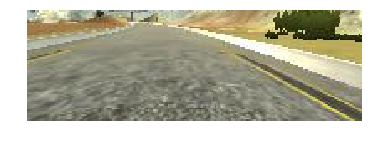
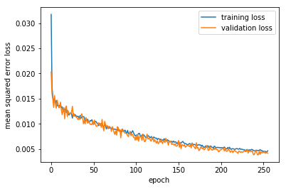

# Behavioral Cloning Project

This project is part of the [Udacity Self-Driving Car Nanodegree Program](https://github.com/udacity/CarND-Behavioral-Cloning-P3). The goals / steps of this project are the following:

* Use the [Udacity-provided driving simulator](https://d17h27t6h515a5.cloudfront.net/topher/2017/February/58ae4594_mac-sim.app/mac-sim.app.zip) to collect data of good driving behavior
* Build a convolution neural network in Keras that predicts steering angles from images
* Train and validate the model with a training and validation set
* Test that the model successfully drives around track once without leaving the road
* Summarize the results with a written report

## 0. File description

The model training notebook is train_clone_drive.ipynb.
The notebook converted to a script (per instructions) is model.py. 
The trained model is model.h5.
The video of the trained model driving on Track 1 is video.mp4.

## 1. Driving the simulator

I began the project by practicing driving in the simulator provided by Udacity. It was harder than I expected to drive well. It got a little easier after I followed advice from the Slack channel to use an analogue input device (a mouse), and I eventually felt comfortable enough to record data. I ultimately drove six recorded laps, four in one direction and two in the other direction around the track. These weren't perfect - in several cases I veered slightly over the lane edge lines - but they seem to work. I used the lowest-resolution version (aka Fastest graphics).

## 2. Loading training data

I loaded the training data by first reading the drive log file line-by-line, and then splitting the lines (each representing one frame) into test and validation sets (80/20 split). In my first attempt, I only used two laps of data, and I could load all of the images into a single large numpy array, including augmentation by horizontal flipping and reading the left and right cameras (see below). Once I included all six laps this exceeded my available memory, so I instead built generators to provide batches of training and validation data.

The training generator works by randomly sampling from the frames in the log, until it has enough to fill one batch. For each frame, it begins by reading the steering angle, then randomly chooses one of the three cameras (center/left/right) and the steering angle is adjusted by a fixed value (zero for the center camera, and +/-0.20 for the left/right cameras). Next the appropriate image is loaded; in 50% of cases it is flipped horizontally and the steering angle multipled by -1, to ensure symmetry. Because OpenCV reads images in BGR format, the image is adjusted to RGB. 

The validation generator also randomly samples from the (validation) frames in the log, until it has enough to fill one batch. It randomly chooses between cameras as with the training data generator, but it doesn't invert the images.

## 3. Model Architecture and Training Strategy

After initially experimenting with LeNet, I decided to use the [Nvidia network](https://arxiv.org/pdf/1704.07911.pdf), with minor modifications. This network makes sense for this application, both because it's based on convolutions, and because it was optimized empirically by the Nvidia team. In my implementation, the network begins by cropping the image down to 66x200 pixels (from 160x320) to match the image size used by Nvidia. It then normalizes images using a simple divide-and-subtract method. The cropped image (before normalization) looks like this:

This pre-processing is followed by five convolution layers, alternating with dropout layers (probability = 0.5). The first three convolution layers are 5x5 with 24, 36, and 48 filters respectively; the final two are 3x3 with 64 filters each. I initially used relu activation, but switched to ELU based on comments from other students; it slows down the training but it seems to help. Following these layers there are four fully connected layers of size 100, 50, 10, and 1, the final one being the prediction of the steering angle.

For training, I used MSE error and the Adam optimizer, and I used the validation data (via the generator) to test for over-fitting. I did the training on a GPU, which significantly accelerated things. Because of using Adam, I didn't have to choose the learning rate. I found it was very easy to overfit the initial version of the model, which didn't include the dropout layers. After some tinkering, I added five of them, to avoid overfitting. I trained using early stopping, but found that I got improvements in the validation dataset all the way up to 256 epochs. The training and validation loss plotted against epoch look like this:

## 4. Testing the model

I primarily tested the trained model on Track 1. I modified drive.py to increase the setpoint of the speed to 20 mph. The car successfully drives around the track multiple times, staying within the lane lines at all times. It seems to handle the curves fine, but it tends to swerve from side to side on the straight segments. I don't know whether this is a result of my poor driving skills, or something about the training.

I had initially experimented with using a left/right camera offset angle of +/-0.25, but I lowered to +/-0.20 to attempt to reduce the swerving. Essentially, this makes the car turn less aggressively, which I hoped would damp down the sweriving. This seems to have worked, although the car waits a little longer before taking the turns, which makes sense - it is not turning as aggressively. Since the overall performance was better on average, I chose the model trained with the value of 0.20 to submit.

I tested the model on Track 2, but it performed very badly, barely making it a few meters before swerving off to the left and crashing.

## 5. Further ideas

0. More data! Adding more training data from well-driven runs would almost certainly improve the model's performance.

1. The Nvidia architecture was trained on images in YUV space, not RGB. In a future version of this project I would convert to YUV for training, especially since I already implemented this for the brightness randomization.

2. The zigzagging in the final model is probably a result of my poor driving skills, since I was not always perfectly consistent in driving well on the straightaways. I could fix this in a future version by adding some kind of PID control (essentially a low-pass filter) to drive.py to smooth out the steering angle changes.

3. One idea discussed in student posts is adding artificial jitter to the images by translating them horizontally and vertically by a random number of pixels, and adjusting the steering angle by a corresponding amount. This helps create more synthetic data, and because we crop the images, we have headroom to do this. I could add this in a future version of the project.

